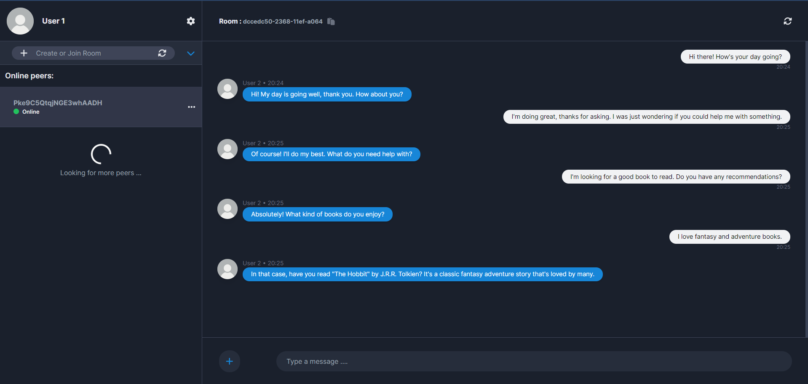
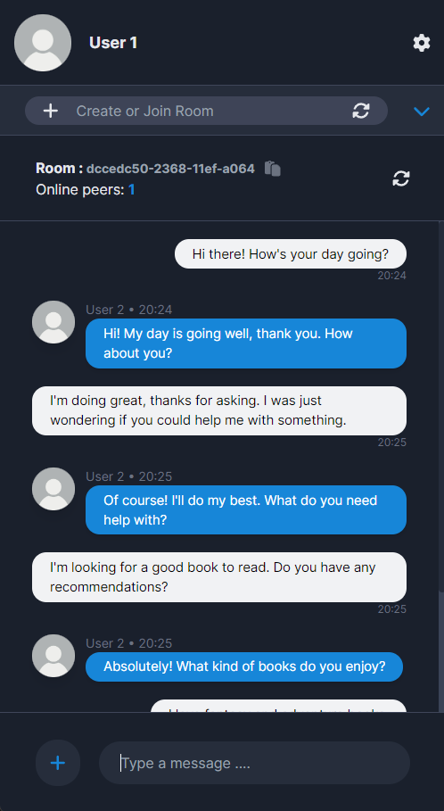

<h1 align="center">

  <br>
  P2P Chat App
  <br>
</h1>

<h4 align="center">A peer-to-peer (P2P) chat app built with <a href="https://nextjs.org" target="_blank">Next.js</a>, allowing users to communicate directly without a central server, using WebRTC for real-time communication.</h4>

<p align="center">


</p>

<p align="center">
  <a href="#introduction">Introduction</a> •
  <a href="#architecture">Architecture</a> •
  <a href="#key-features">Key Features</a> •
  <a href="#getting-started">Getting Started</a> •
  <a href="#run-with-docker">Run with Docker</a> •
  <a href="#deploy-on-vercel">Deploy on Vercel</a> •
  <a href="#demonstration">Demonstration</a>
</p>


## Introduction

We are building an exciting peer-to-peer securechat application for our first year development project. The web app connects people and groups of people of up to 10 members and provides both file and image transfer functionalities, as well as audio and video calls between peers.

In order to make sure our application functions correctly, we are using multiple protocols and functionalities in order to secure the basic foundations of a chat application. Notably, storage and peer discovery are important aspects to which we took time to find technical solutions. 

## Architecture

- This chat application is based on a decentralized peer-to-peer architecture.
- We chose Next.js for the front end due to its robust features like server-side rendering, static site generation, and seamless integration with React.
  - These features enhance performance and SEO.
- Tailwind CSS was selected for its utility-first approach, allowing rapid and efficient styling.
- Together, these technologies provide a scalable, high-performance, and visually appealing user experience.
- We chose WebRTC for peer discovery to enable real-time communication directly between users' browsers.
- WebRTC ensures low-latency, high-quality audio and video transmission without plugins.
- A signaling server is indispensable for establishing peer-to-peer connections.
- Without this server, peers cannot negotiate direct communication connections.
- We use RSA (asymmetric) and AES (symmetric) encryption methods for data encryption.
- RSA is used for securely exchanging keys between users, Once the secure channel is established, AES is used for actual data transmission..
- We chose GunDB for the storage part, leveraging its integration with IPFS, which provides decentralized, resilient, and efficient data storage.
  - GunDB's graph-based structure allows real-time data synchronization and offline capabilities.
  - Using IPFS enhances data availability, integrity, and redundancy across a peer-to-peer network.
  - This combination ensures robust, scalable, and fault-tolerant storage, making user data consistently accessible and secure.


## Key Features
- Realtime communication
- Allow multiple users in a room
- Secure Messaging
  - Encrypting messages with AES-256
- File transfer
- Dark & light mode
- Responsive for both Mobile & Desktop users
- Support mutliple Languages
  - French, English, Arabic and even Amazigh
- Image sending
- Notifications System with Sound
- Message history
  - You can see messages in the room even if you weren't connected
- Changing Username & Profile Picture

## Responsive 
This project is designed to be highly responsive, ensuring a seamless user experience across devices of all sizes. Whether you're accessing the project on a desktop, tablet, or smartphone, you can expect the same level of functionality and performance.
<div class="flex">
    
    
    
</div>


## Getting Started

First, run the client:

```bash
npm run dev
# or
yarn dev
# or
pnpm dev
# or
bun dev
```
Then, you need to run the signaling Server:
```bash
cd signaling
npm run dev
```
Open [http://localhost:3000](http://localhost:3000) with your browser to see the result.


## Run with Docker
You can run this application using Docker

```bash
docker pull badrelhouari/docker-chatapp
docker run --name app -p 3000:3000 -d badrelhouari/docker-chatapp
```

Open [http://localhost:3000](http://localhost:3000) with your browser to see the result.

## Deploy on Vercel

The easiest way to deploy your Next.js app is to use the [Vercel Platform](https://vercel.com/new?utm_medium=default-template&filter=next.js&utm_source=create-next-app&utm_campaign=create-next-app-readme) from the creators of Next.js.

Check out our [Next.js deployment documentation](https://nextjs.org/docs/deployment) for more details.

## Demonstration
Here is a link to the video demonstration of this project: <a href="https://youtu.be/jGN7IZOTA1c" target="_blank">Demo</a>